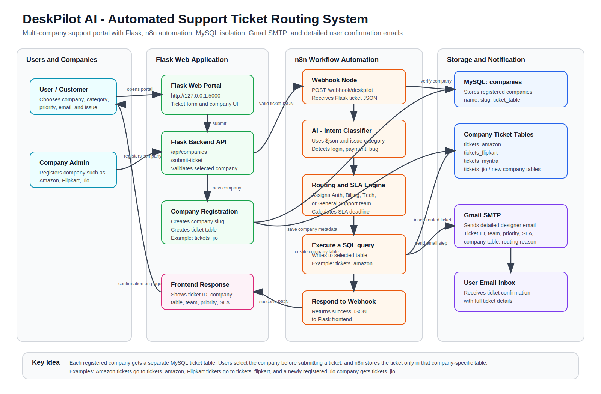
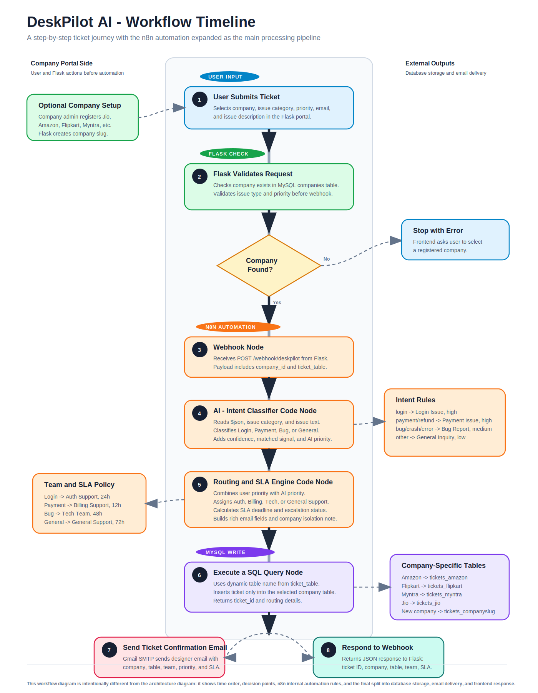

# DeskPilot AI - Automated Support Ticket Routing System

DeskPilot AI is a full-stack support automation project that accepts customer tickets from a Flask web portal, sends them to an n8n automation workflow, classifies the issue, assigns priority and SLA, stores the ticket in MySQL, and sends a detailed confirmation email to the customer.

The updated version supports multiple companies such as Amazon, Flipkart, Myntra, and newly registered companies. Each company can maintain its own ticket records while users select the company and issue type from the website.

## Project Highlights

- Multi-company ticket portal with company registration
- Rule-based AI intent classification for login, payment, bug, crash, and general issues
- Priority resolution using both user priority and automation logic
- SLA calculation and team routing through n8n
- MySQL storage with company-wise ticket organization
- Designer email confirmations using Gmail SMTP through n8n
- Frontend response after workflow execution
- Architecture, workflow, and draw.io diagrams included for reports

## Architecture



## n8n Workflow



## Technology Stack

| Layer | Technology |
| --- | --- |
| Frontend | HTML, CSS, JavaScript |
| Backend | Python, Flask |
| Automation | n8n Webhook, Code Nodes, MySQL Node, Email Node |
| Database | MySQL |
| Email | Gmail SMTP |
| Integration | REST Webhook |
| Diagrams | SVG and draw.io |

## Folder Structure

```text
DeskPilot AI
├── app.py
├── database.sql
├── requirements.txt
├── .env.example
├── .gitignore
├── README.md
├── DEPLOYMENT.md
├── templates/
│   └── index.html
├── n8n_workflow_FINAL_WITH_RANDOM_TICKET_ID.json
├── deskpilot_architecture.svg
├── deskpilot_workflow.svg
├── deskpilot_workflow_diagram.svg
└── deskpilot_workflow_diagram.drawio
```

## Main Features

### 1. User Ticket Submission

Users can submit a ticket by selecting a company, issue category, priority, and entering their email and issue description.

### 2. Company-Based Ticket Management

The system supports registered companies. New companies can be added from the portal, and tickets are separated using company-specific routing and storage logic.

### 3. AI-Based Classification

The n8n Code Node classifies ticket intent using rule-based AI logic:

- Login Issue
- Payment Issue
- Bug Report
- General Inquiry

### 4. Routing and SLA Engine

Tickets are assigned to teams based on intent:

| Intent | Assigned Team | SLA |
| --- | --- | --- |
| Login Issue | Auth Support | 24 hours |
| Payment Issue | Billing Support | 12 hours |
| Bug Report | Tech Team | 48 hours |
| General Inquiry | General Support | 72 hours |

### 5. Email Confirmation

After successful routing, the customer receives a detailed confirmation email containing ticket status, assigned team, priority, SLA details, and support information.

## Local Setup

### 1. Install Python Dependencies

```powershell
pip install -r requirements.txt
```

### 2. Create MySQL Database

Open Command Prompt or PowerShell and run:

```powershell
mysql -u root -p < database.sql
```

### 3. Set Environment Variables

PowerShell:

```powershell
$env:MYSQL_PASSWORD="your_mysql_password"
$env:N8N_WEBHOOK_URL="http://localhost:5678/webhook/deskpilot"
```

### 4. Start n8n

```powershell
npx n8n
```

Open n8n at:

```text
http://localhost:5678
```

Import:

```text
n8n_workflow_FINAL_WITH_RANDOM_TICKET_ID.json
```

### 5. Start Flask

```powershell
python app.py
```

Open:

```text
http://127.0.0.1:5000
```

## Test Cases

| Issue | Expected Team | Expected Priority |
| --- | --- | --- |
| I cannot login | Auth Support | High |
| Payment failed | Billing Support | High |
| App crashed | Tech Team | Medium |

## Project Novelty

DeskPilot AI is different from ordinary helpdesk tools because it combines a lightweight web portal, company-specific ticket segregation, n8n workflow automation, AI-style rule classification, SLA routing, MySQL persistence, and automated email confirmation in one end-to-end academic project. It is easier to demonstrate, customize, and deploy than large commercial systems while still showing real-world support automation concepts.

## Deployment

For complete deployment instructions, see [DEPLOYMENT.md](DEPLOYMENT.md).

## Security Notes

- Do not commit real MySQL passwords, Gmail passwords, or SMTP app passwords.
- Use `.env` or environment variables for local secrets.
- Use Gmail App Passwords instead of your normal Gmail account password.
- Use HTTPS and a production MySQL user for real deployment.
